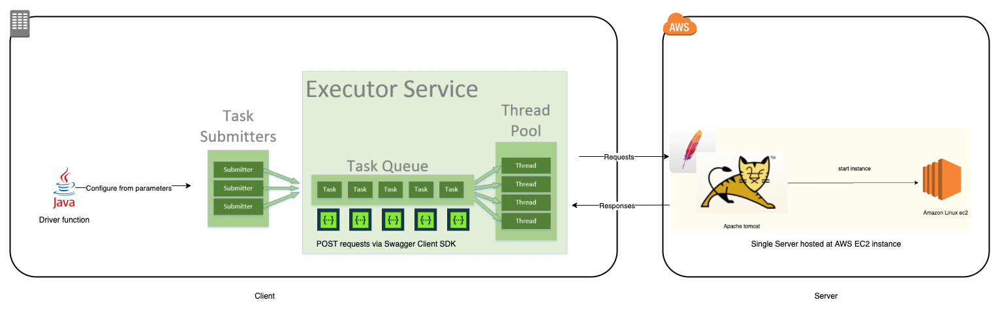

# Lab 4 - Milestone 1

Created: February 5, 2022 10:15 PM
Date: February 18, 2022
References: https://github.com/gortonator/bsds-6650/blob/master/assignments-2021/Assignment-1.md
Tags: AWS EC2, Client-Server Model, ExecutorService, Java Multithreaded, Java Servlet, Little's Law, Performance Analysis, Tomcat

](img/Untitled.png)

[https://www.youtube.com/watch?v=UYZvIc_gxo8&list=PLLGiwLi4Z63sQdoptiqqLzHTgBHBK83ed&index=9&t=111s](https://www.youtube.com/watch?v=UYZvIc_gxo8&list=PLLGiwLi4Z63sQdoptiqqLzHTgBHBK83ed&index=9&t=111s)

# **Milestone 1!**

## Architecture



In this Lab, you will hit a milestone by finishing the build of a client that generates and sends lift ride data to a server in the cloud. The server will simply accept and validate requests, and send an HTTP 200/201 response. In future labs, we’ll add the processing and storage logic to the server, and send a richer set of requests.

Note: you have now been put in **groups** (check the "group" tab under "[people](https://northeastern.instructure.com/courses/103143/users)") to work together on this, and create the most impressive milestone you can!  Your mock interviews are still individual, but you will present your milestone to Peter from Amazon, as a group during our class time on Feb 22.  You will have a 10minute time slot to blow him away! :)

# **Implement the Server API**


Make sure Lab 3 is working! :)  Now, complete *the rest* of the Server API, beyond just the skiers information!

## [resorts](https://app.swaggerhub.com/apis/cloud-perf/SkiDataAPI/1.16#/resorts) Ski Resort Lift Data information

`GET[/resorts](https://app.swaggerhub.com/apis/cloud-perf/SkiDataAPI/1.16#/resorts/getResorts)`

get a list of ski resorts in the database

`GET[/resorts/{resortID}/seasons/{seasonID}/day/{dayID}/skiers](https://app.swaggerhub.com/apis/cloud-perf/SkiDataAPI/1.16#/resorts/getResortSkiersDay)`

get number of unique skiers at resort/season/day

`GET [/resorts/{resortID}/seasons](https://app.swaggerhub.com/apis/cloud-perf/SkiDataAPI/1.16#/resorts/getResortSeasons)`

get a list of seasons for the specified resort

`POST [/resorts/{resortID}/seasons](https://app.swaggerhub.com/apis/cloud-perf/SkiDataAPI/1.16#/resorts/addSeason)`

Add a new season for a resort

### [skiers](https://app.swaggerhub.com/apis/cloud-perf/SkiDataAPI/1.16#/skiers) Information about skiers and their lift usage

`POST [/skiers/{resortID}/seasons/{seasonID}/days/{dayID}/skiers/{skierID}](https://app.swaggerhub.com/apis/cloud-perf/SkiDataAPI/1.16#/skiers/writeNewLiftRide)`

write a new lift ride for the skier

`GET [/skiers/{resortID}/seasons/{seasonID}/days/{dayID}/skiers/{skierID}](https://app.swaggerhub.com/apis/cloud-perf/SkiDataAPI/1.16#/skiers/getSkierDayVertical)`

get ski day vertical for a skier

`GET [/skiers/{skierID}/vertical](https://app.swaggerhub.com/apis/cloud-perf/SkiDataAPI/1.16#/skiers/getSkierResortTotals)`

get the total vertical for the skier for specified seasons at the specified resort

### [statistics](https://app.swaggerhub.com/apis/cloud-perf/SkiDataAPI/1.16#/statistics) Server side response time values

`GET [/statistics](https://app.swaggerhub.com/apis/cloud-perf/SkiDataAPI/1.16#/statistics/getPerformanceStats)`

get the API performance stats

As before, you need to implement these API calls using a Java servlets. Each API should:

1. Accept the parameters for each operations as per the specification
2. Do basic parameter validation, and return a 4XX response code and error message if invalid values/formats supplied
3. If the request is valid, return a 200/201 response code and some dummy data as a response body

Good simple illustrations of how to handle JSON request payloads are [here (Links to an external site.)](https://edwin.baculsoft.com/2011/11/how-to-create-a-simple-servlet-to-handle-json-requests/) and [here (Links to an external site.)](https://www.baeldung.com/servlet-json-response).

Test each servlet API with [POSTMAN (Links to an external site.)](https://www.getpostman.com/downloads/) or an equivalent HTTP testing tools. Deploy your server on AWS Academy.  Make sure you can load the resulting .war file onto your EC2 free tier instance you have created and configured in Lab 1 and call the APIs successfully.

# Build the Client (NOW we will get the party started!)


This is the major part of *this* lab. We want a multithreaded Java client we can configure to upload a day of lift rides to the server and exert various loads on the server.

Your client should accept a set of parameters from the command line (or a parameter file) at startup. These are:

1. maximum number of threads to run (numThreads - max 1024)
2. number of skier to generate lift rides for (numSkiers - max 100000), This is effectively the skier’s ID (skierID)
3. number of ski lifts (numLifts - range 5-60, default 40)
4. mean numbers of ski lifts each skier rides each day (numRuns - default 10, max 20)
5. IP/port address of the server

In addition, each ski day is of length 420 minutes (7 hours - 9am-4pm) from when the lifts open until they all close.

Based on these values, your client will start up and execute 3 phases, with each phase sending a large number of lift ride events to the server API.

Phase 1, the *startup* phase, will launch numThreads/4 threads, and each thread will be passed:

- a start and end range for skierIDs, so that each thread has an identical number of skierIDs, calculated as numSkiers/(numThreads/4). Pass each thread a disjoint range of skierIDs so that the whole range of IDs is covered by the threads, ie, thread 0 has skierIDs from 1 to (numSkiers/(numThreads/4)), thread 1 has skierIDs from (1x(numSkiers/(numThreads/4)+1) to (numSkiers/(numThreads/4))x2
- a start and end time, for this phase this is the first 90 minutes of the ski day (1-90)

For example if numThreads=64 and numSkiers=1024, we will launch 16 threads, with thread 0 passed skierID range 1 to 64, thread 1 range 65 to 128, and so on.

Once each thread has started it should send (numRunsx0.2)x(numSkiers/(numThreads/4)) POST requests to the server. Each POST should *randomly* select:

1. a skierID from the range of ids passed to the thread
2. a lift number (liftID)
3. a time value from the range of minutes passed to each thread (between start and end time)
4. a wait time between 0 and 10

With our example, if numRuns=20, each thread will send 4x(1024/16) POST requests.

The server will return an HTTP 201 response code for a successful POST operation. As soon as the 201 is received, the client should immediately send the next request until it has exhausted the number of requests to send.

If the client receives a 5XX response code (Web server error), or a 4XX response code (from your servlet), it should retry the request up to 5 times before counting it as a failed request.

Once 20% (rounded up) of the threads in Phase 1 have completed, Phase 2, the *peak phase* should begin. Phase 2 behaves like Phase 1, except:

- it creates *numThreads* threads
- the start and end time interval is 91 to 360
- each thread is passed a disjoint skierID range of size (numSkiers/numThreads)

As above, each thread will randomly select a skierID, liftID and time from the ranges provided and sends a POST request. It will do this (numRunsx0.6)x(numSkiers/numThreads) times. Back to our example above, this means phase 2 would create 64 threads, and and each sends 12*(1024/64) POSTs.

Finally, once 20% of the threads in Phase 2 complete, Phase 3 should begin. Phase 3, the *cooldown phase*, is identical to Phase 1, starting 10% of numThreads, with each thread sending (0.1xnumRuns) POST requests, and with a time interval range of 361 to 420.

When all threads from all phases are complete, the programs should print out:

1. number of successful requests sent
2. number of unsuccessful requests (ideally should be 0)
3. the total run time (wall time) for all phases to complete. Calculate this by taking a timestamp before commencing Phase 1 and another after all Phase 3 threads are complete.
4. the total throughput in requests per second (total number of requests/wall time)

You should run the client on your laptop. Thus means each request will incur latency depending on where your server resides. You should test how long a single request takes to estimate this latency. Run a simple test and send eg 10000 requests from a single thread to do this.

You can then calculate the expected throughput your client will see using Little’s Law.

If your throughput is not close to this estimate for each of the test runs, you probably have a bug in your client.

## Checkpoint


# Instrumenting the Client (déjà vu?!)


With your load generating client working wonderfully, we want to now (again) instrument the client so we have deeper insights into the performance of the system. This is *EXACTLY what you did in Lab 3*, but for each POST request:

- before sending the POST, take a timestamp
- when the HTTP response is received, take another timestamp
- calculate the latency (end - start) in milliseconds
- Write out a record containing {start time, request type (ie POST), latency, response code}. CSV is a good file format.

Once all phases have completed, we need to calculate:

- mean response time (millisecs)
- median response time (millisecs)
- throughput = total number of requests/wall time (requests/second)
- p99 (99th percentile) response time

You may want to do all the processing of latencies in your client after the test completes, or you may want to write a separate program to run after the test has completed that generates the results. Check your results against those calculated in a spreadsheet.

The client should calculate these and display them in the output window in addition to the output from the previous step, and then cleanly terminate.

```
mean response time:   23.3ms
median response time: 6.0ms
p99 (99th percentile) response time: 138.0ms
throughput = 11838requests/5056ms = 2356requests/second
```

# Deliverables

In order to really *grok* everything you've just done, be ready with the following for your mock interview

1. all of your running code, be ready to demo anything!
2. a high-level **architecture diagram** of your system, identifying the key components
3. your incredible performance analysis, with thought given to the tradeoffs you have made in your system!

# Troubleshoots

## Restart Tomcat on AWS EC2

[https://medium.com/@shrunk7byadagi/automatically-start-tomcat-on-instance-startup-reboot-in-amazon-ec2-ubuntu-instance-33849a9d9090](https://medium.com/@shrunk7byadagi/automatically-start-tomcat-on-instance-startup-reboot-in-amazon-ec2-ubuntu-instance-33849a9d9090)

1. Once you login in to the AWS instance from terminal, switch to root user by executing following command.

```bash
$ sudo su -
```

1. Navigate to `/usr/share/tomcat/bin` directory by executing following command.

```bash
# cd /usr/share/tomcat/bin
```

1. Restart Tomcat by `shutdown` and `startup` sh commands

```bash
# sh shutdown.sh
# sh startup.sh
```

# References:

## **Interface ExecutorService**

[https://docs.oracle.com/javase/8/docs/api/java/util/concurrent/ExecutorService.html](https://docs.oracle.com/javase/8/docs/api/java/util/concurrent/ExecutorService.html)

*[ExecutorService](https://docs.oracle.com/en/java/javase/11/docs/api/java.base/java/util/concurrent/ExecutorService.html)* is a JDK API that simplifies running tasks in asynchronous mode. Generally speaking, *ExecutorService* automatically provides a pool of threads and an API for assigning tasks to it.

[](https://www.baeldung.com/java-executor-service-tutorial)